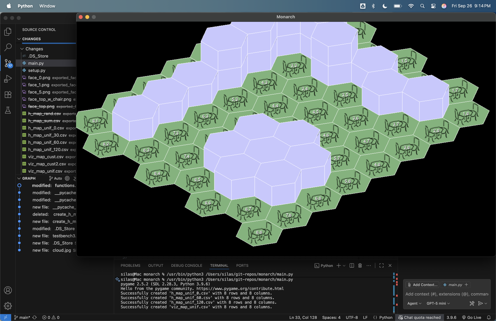
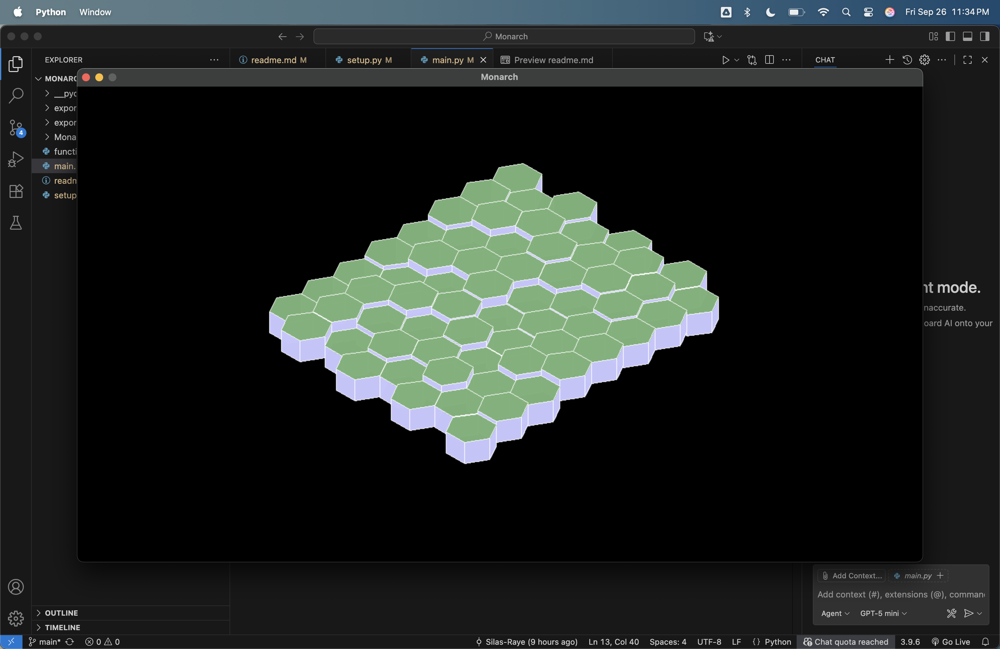

# The Monarch Hotel
### Game Design Document

## Recent Featured Screenshot
Right now all the game can do is render environments made of hexagonal cells. My next step is to add a movable character and game scrolling like in Hades.

## The Team
- Lead Story Writer: Mitch
- Lead Artist: Maddie
- Lead Developer: Silas
- Consulting Etymologists: Walker (Si's friend). Mitch, I think I met an etymologist friend of yours when I visited Cali. They are welcome to join as consultants if they want lol

## Real Life Inspiration
- Leopard caterpillars, excrete sugar water to get ants to be their servants

- [Pic from "Fierce Little Creatures"](https://le.kloofconservancy.org.za/fierce-little-creatures-butterfly-ant-mutualism/)

## Brainstorming Notes
Maddie and I had a brainstorming session earlier in the month and here's what we came up with:
- The game is in an isometric style with a grid made of hexagonal cells.
- Art style inspiration: Anime, Plant Tycoon.

## Gameplay Loops
- **Primary gameplay loop:** Economics. You are the queen of an ant colony and you have a symbiotic relationship with butterfly clients who start out as caterpillars, and these caterpillars pay you in sugar water to stay at your hotel. You can use that same sugar water to upgrade and renovate the hotel and get more clients.
- **Secondary gameplay loop:** Gaining ants for your army. The first level of the game takes place at the main character's last ant colony where she was a princess, not a queen. You play a little Snake minigame, and every ant you pick up adds to the size of your starter colony. Like sugar water, the number of ants working for you is tracked throughout the game. Different ant servants do different jobs: Carpenter, cleaning lady, gardener, butler, guards, bellhops, chefs, etc. They all work slowly unless you get more of them, and then they work together faster. Your job is to keep the clients that you have happy and gain more clients. If customers don't get tasty food, clean quarters, and other necessities in time, they get angry and leave.
- **Tertiary gameplay loop:** When you first start the game, there's a barren garden outside of the hotel. You can use your sugar water to purchase different plants and attract different types of butterflies. The hotel is inside a hllow tree, the garden is on a moss-covered mushroom and in planter boxes, and below the hotel, on another smaller mushroom, there's a garden shop where you can buy seeds. Different butterflies like different plants. E.g., Milkweed attracts monarch butterflies. Some butterflies are more rare and high class than others. As you expand your hotel, you gain more garden space out front and even gain some window boxes.

## Story
- The main character was a princess in a large ant colony and decides to make a name for herself and start her own colony (maybe there's some family drama with the curent queen or her sisters?).
- The game opens with a cutscene of a rundown hotel inside a hollow tree. There is an overgrown garden on a moss-covered mushroom on the side of the tree that serves as a landing pad/entranceway. 
- Cut to your character on the screen thinking out loud that they need to gather their friends and fix the place up. They see the potential.
- Cut to you at home in your busy anthill. You have to gather up all of your closest ant friends and go start fixing up this hotel. It's like playing Snake — every pickup increases your tail by one ant. You die when you hit your tail, up to a maximum number, and those are your starting ant helpers for the first level.
- You have a little sugar water symbol and a little ant symbol, and those are the two main currencies. You also have a seed box. You can pay sugar water to assign a role to each of your helper ants, as needed. 
- There are some hotel guests that are recurring characters that you come to know over the course of the game.

## Other Story And Level Ideas
- Fixing up the hotel. You have to build rooms for all the different stages of life: larva, caterpillars, chrysalis, and full-grown butterflies.
- Buying seeds and building your garden.
- Because the grid is made of hexagonal cells, it would be very easy to draw a honeycomb pattern and have a level where you interact with bees.
- Other than these butterflies and ants, are there any other insects we are interested in including? Maybe there's a dung beetle hermit who lives on the edge of town? The possibilities are endless.
